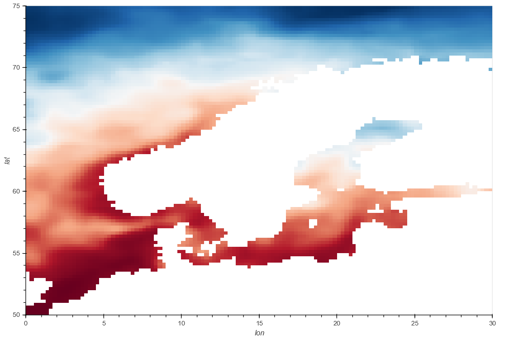

# SST Process
### Geosoftware II Project WiSe 2020/21 
---

## Table of contents
[1. Overview](#overview)\
[2. Installation](#install)\
[3. Scope of functionalities](#functionalities)\
[4. Examples of use](#use)\
[5. Technologies](#technologies)

\
<a name="overview"><h3>Overview</h3></a>
This project is part of a new [openEO](https://openeo.org/) backend driver using the [Pangeo Software Stack](https://pangeo.io/), in particular xArray and Dask.

The goal of this microservice is to calculate the mean sea surface temperature over a from the user input timeframe and spatial subset. The data for the calculation comes from a netCDF Datacube containing sst data. 

There also exists a [Docker Repository](https://hub.docker.com/repository/docker/felixgi1516/geosoft2_sst_process), which is linked with this one and from which the service can be obtained as an image. And can then be used locally as a container.

\
<a name="install"><h3>Installation</h3></a>
:warning: _Die folgende Installation ist noch nicht verfügbar. Der Port und ähnliches können sich noch ändern._ 

Die Installation und Ausführung des Containers erfolgt über den Befehl:
```
docker run -p 3000:3000 felixgi1516/geosoft2_sst_process
````

\
<a name="functionalities"><h3>Scope of functionalities</h3></a>

The mean sea surface temperature calculations are done via the central method 'mean_sst', which takes 3 parameters:

1. `data` A datacube in netCDF format. The datacube must have the dimensions 'lon', 'lat' and 'time' and the data varible 'sst'
2. `timeframe` An array with two values: [start date, end date]. The dates must be in the [ISO 8601](https://www.iso.org/iso-8601-date-and-time-format.html) format **yyyy-mm-dd** (e.g. ['2007-06-01','2007-08-31']). 
3. `bbox` A bounding box with four values: [min Longitude, min Latitude, max Longitude, max Latitude]. For example [0, 50, 30, 75] for North Europe. This parameter is optional. If this parameter isn't specified the mean will be calculated over the whole spatial dimension of the dataset. 

The central  method 'mean_sst' uses the function 'createSubset' to create the spatial subset. The parameters for this function are:

1. `ds` The dataset from which a subset is generated
2. `minLon` left value of the subset
3. `minLat` bottom value of the subset
4. `maxLon` right value of the subset
5. `maxLat` top value of the subset

Both methods, 'mean_sst' and 'createSubset', are not meant to be used on their own, but rather always through the method 'exceptions_mean_sst'. This method 
checks the parameter values the user put in and throws exceptions for invalid inputs, e.g. for wrong parameter type, for timeframes and bounding boxes which go over the range of the dataset, for wanting to calculate mean sst on a dataset, that doesn't contain sst data, and more.  

Since most sst datasets have longitude values from 0 to 360 the function 'createSubset' can also create subsets where minLon is greater than maxLon. This has the advantage that it is possible to create a subset for the whole of Europe, which would otherwise be split by the prime meridian. So for example [360, -20, 50, 20] would be a valid input for the parameter bbox. The same is not true for latitude values. [0, 50, 130, -50] is not valid!

<a name="use"><h3>Examples of use</h3></a>
The Microservice can be used via an endpoint.

:bangbang: here exapmle job description

Visualized the results can look like this:


Weltweites Mittel des 01.01.1981


Mittel des Monats Oktober 1981 für den Raum Nordeuropa

\
<a name="technologies"><h3>Technologies</h3></a>

Software | Version
------ | ------
[Python](https://www.python.org/)   | 3.8.6
[xarray](http://xarray.pydata.org/en/stable/)   | 0.16.1
[dask](https://dask.org/)   | 2.30.0
Flask | 1.1.2
requests | 2.25.0
flask_cors | 3.0.9
numpy | 1.19.3
scipy | 1.5.4
netcdf4 | 1.5.4

